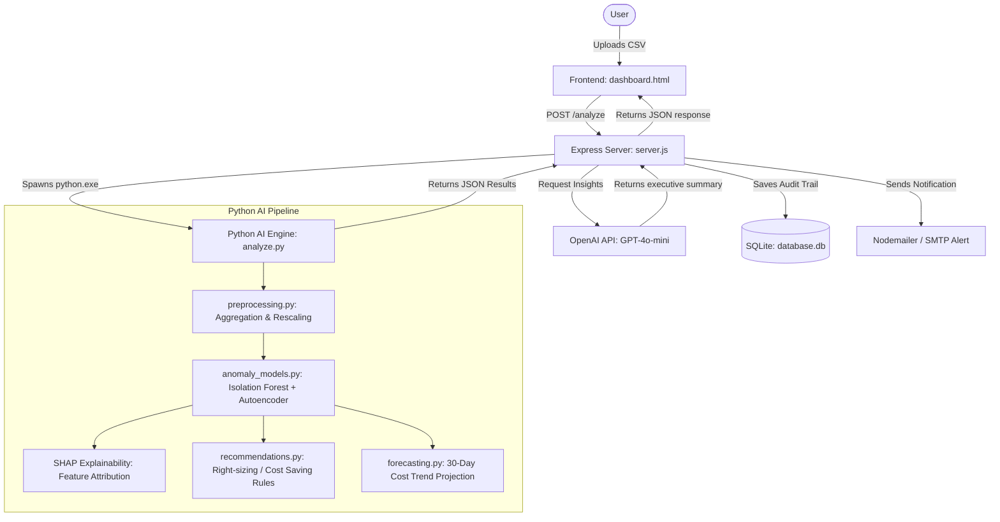

# CloudPulse (AI-Driven Cloud Cost Anomaly Detection)

CloudPulse is a robust, full-stack, intelligence-powered Cloud FinOps and cost optimization platform. It helps engineering and finance teams monitor, analyze, and optimize cloud billing data (e.g., Google Cloud Platform billing exports). The application leverages advanced Machine Learning models (Isolation Forest and Autoencoders) for multi-dimensional anomaly detection, explains cost drivers using Explainable AI (SHAP), and provides AI-driven FinOps recommendations using OpenAI GPT.

---

## 🌟 Key Features

1. **Intelligent Cost Anomaly Detection**:
   - **Isolation Forest**: Identifies outlier cost patterns and structural anomalies based on cost, usage quantity, and change metrics.
   - **Autoencoder Neural Network**: Utilizes deep reconstruction error-based anomaly detection to catch complex, non-linear spend deviations.
   - **Ensemble Decisioning**: Combines both models to minimize false positives and maximize detection sensitivity.
2. **Explainable AI (XAI) with SHAP**:
   - Computes feature attribution weights for each anomaly, indicating the exact statistical drivers (e.g., severe absolute cost spikes, high baseline deviation, rolling average deviation) responsible for the flag.
3. **Automated FinOps Recommendations & Forecasting**:
   - Categorizes anomaly severity (Low, Medium, High).
   - Generates actionable right-sizing recommendations based on hardware utilization metrics (CPU/Memory thresholds).
   - Projects future cloud spend utilizing 30-day linear regression cost forecasting.
4. **AI-Powered Root-Cause Insights**:
   - Translates raw anomaly logs into readable executive insights using OpenAI GPT, explaining the root causes, risks, and prevention steps.
5. **Secure Verification & Alerts**:
   - OTP-based user registration and forgot-password verification.
   - Direct email alerts sent via Nodemailer/SMTP containing the cost breakdown and AI insights when an anomaly is detected.
6. **Detailed Dashboard & History**:
   - Interactive charts of historical cost runs.
   - Profile settings and self-managed password resets.
7. **Modern Interactive UX**:
   - Futuristic dark/light glassmorphic UI styled with neon gradients.
   - Collapsible/foldable navigation sidebar to maximize screen workspace.
   - Foldable accordion-drawer for user settings and account session controls.

---

## 🏗️ Architecture Flow



---

## 🛠️ Tech Stack

### Frontend
- **HTML5 & CSS3 (Vanilla)**: For clean, modern UI styled with dark-mode glassmorphism aesthetics.
- **JavaScript (ES6)**: Handles interactive page transitions, file uploads, historical chart renders, and asynchronous fetch updates.

### Backend
- **Node.js & Express**: Drives web API routes, session management, file uploads, and background execution.
- **SQLite3**: Lightweight, zero-configuration database mapping users, verification statuses, and historical runs.
- **Nodemailer**: Dispatches email alerts and OTPs.
- **OpenAI Node Client**: Communicates with the OpenAI API for LLM-based FinOps audits.
- **Multer**: Manages incoming billing file uploads.
- **Bcrypt**: Secures user passwords using cryptographic salt hashing.

### AI Engine (Python)
- **Pandas & NumPy**: Cleans, parses, and structures time-series metrics.
- **Scikit-Learn**: Implements Isolation Forest for unsupervised anomaly detection.
- **TensorFlow / Keras**: Constructs and trains the deep Autoencoder network on CPU/Memory/Cost indicators.
- **SHAP (SHapley Additive exPlanations)**: Produces explainable attributions for deep model predictions.

---

## 📂 Project Directory Structure

```text
cloudpulse_vjs/
├── README.md                  # This documentation file
├── LICENSE                    # MIT/Apache license documentation
├── Dockerfile                 # Docker configuration for cloud hosting (Render/Railway)
├── .dockerignore              # Ignore rules for Docker build context
├── uploads/                   # Temporary directory for uploaded CSVs
├── public/                    # Frontend files (Static assets)
│   ├── login.html             # Login credentials page
│   ├── signup.html            # Registration & verification page
│   ├── reset.html             # Password recovery / update page
│   ├── dashboard.html         # Main dashboard console
│   ├── dashboard.js           # Charting & dashboard actions
│   └── style.css              # Custom style sheet
├── server/                    # Node.js Express server
│   ├── .env                   # API Keys & email settings
│   ├── server.js              # Express routing & server lifecycle
│   ├── auth.js                # Signup, login & verification handlers
│   ├── db.js                  # SQLite database setup and migration schema
│   ├── mailer.js              # Nodemailer templates (OTP, reset link, alerts)
│   ├── llmEngine.js           # OpenAI API interface
│   ├── migrate.js             # Utility db updates
│   └── package.json           # Node configuration and dependencies
└── ai_engine/                 # Python Machine Learning core
    ├── .venv/                 # Local Python virtual environment
    ├── analyze.py             # Entrypoint script spawned by Node
    ├── anomaly_models.py      # Isolation Forest, Autoencoders, and SHAP
    ├── preprocessing.py       # Cost & usage parsing
    ├── recommendations.py     # FinOps cost-savings rules
    ├── forecasting.py         # Cost trend regression
    └── gcp_testing_dataset.csv# Pre-packaged sample billing dataset
```

---

## 🚀 Setup & Installation

### Step 1: Clone & Navigate
Ensure you have [Node.js](https://nodejs.org/) (v16+) and [Python](https://www.python.org/) (v3.10+) installed.

```bash
cd cloudpulse_vjs
```

### Step 2: Configure the AI Engine (Python)
Navigate to the `ai_engine` folder and set up a Python virtual environment:

```bash
cd ai_engine
# Create a virtual environment
python -m venv .venv

# Activate the virtual environment
# On Windows:
.venv\Scripts\activate
# On Linux/macOS:
source .venv/bin/activate

# Install required dependencies
pip install numpy pandas scikit-learn tensorflow shap
```
*Note: Ensure your virtual environment is located at `ai_engine/.venv/` so the Node server can locate the python executable at `ai_engine/.venv/Scripts/python.exe` (or `ai_engine/.venv/bin/python` on Linux).*

### Step 3: Configure Backend Server (Node.js)
Navigate to the `server` folder, install Node dependencies, and configure the environment variables:

```bash
cd ../server
npm install
```

Create or edit the `.env` file under `server/.env` with your API details:

```ini
EMAIL_USER=yourgmail@gmail.com
EMAIL_PASS=your_app_password
OPENAI_API_KEY=your_openai_key
```

> [!NOTE]
> If `EMAIL_USER` or `EMAIL_PASS` are left blank or configured with placeholders, the server automatically defaults to **Mock Mode**. OTP validation codes, reset links, and cost anomaly alerts will be logged directly to the server terminal console instead of sending actual emails.

---

## 🏃 Run the Application

Start the Express web server from the `server` directory:

```bash
npm start
```
The server will bind to `http://localhost:3000`.

1. Open your browser and navigate to `http://localhost:3000` (it will redirect to the `/login.html` page).
2. Sign up for a new account.
   - If SMTP is configured, verify the OTP code sent to your email.
   - If SMTP is not configured (Mock Mode), look at the node terminal output to copy the 6-digit OTP code.
3. Login and upload the provided sample dataset `ai_engine/gcp_testing_dataset.csv` via the upload panel.
4. View detected anomalies, SHAP explanation factors, future forecast charts, and real-time AI recommendations.

---

## 🐳 Docker Deployment (Render / Railway / Fly.io)

This project is pre-configured with a `Dockerfile` that packages both the Node.js Express backend and the Python machine learning engine (with TensorFlow, SHAP, scikit-learn, pandas, numpy) into a single container.

### Deploying to Render
1. Push your repository to **GitHub**.
2. Create a new **Web Service** on **Render**.
3. Select **Docker** as the environment runtime.
4. Set the following **Environment Variables**:
   - `OPENAI_API_KEY`: Your OpenAI API key.
   - `EMAIL_USER`: Your Gmail address (for alerts).
   - `EMAIL_PASS`: Your Gmail App Password.
   - `DB_PATH`: `/var/data/database.db` (for database persistence).
5. Add a **Persistent Disk** under **Advanced Settings**:
   - **Mount Path**: `/var/data`
   - **Size**: 1 GB
6. Deploy! Render will build the Docker container and start hosting your service automatically.